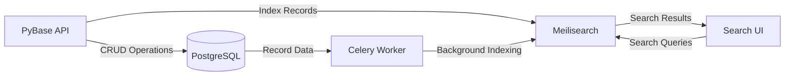

# Meilisearch Setup Guide

This guide covers the complete setup, configuration, and usage of Meilisearch for full-text search in PyBase.

## Table of Contents
- [Overview](#overview)
- [Quick Start](#quick-start)
- [Installation Options](#installation-options)
- [Configuration](#configuration)
- [Indexing Strategy](#indexing-strategy)
- [Search API Usage](#search-api-usage)
- [Performance Optimization](#performance-optimization)
- [Monitoring and Maintenance](#monitoring-and-maintenance)
- [Troubleshooting](#troubleshooting)
- [Production Deployment](#production-deployment)

## Overview

Meilisearch is an open-source search engine that provides:
- **Lightning-fast search**: Sub-100ms response times even with millions of documents
- **Typo tolerance**: Handles misspellings automatically
- **Faceted search**: Filter results by any field
- **Relevance ranking**: Intelligent result ordering
- **Highlighting**: Highlights matching terms in results

### Architecture



## Quick Start

### Using Docker Compose (Recommended for Development)

```bash
# Start Meilisearch with the search profile
docker compose --profile search up -d meilisearch

# Verify it's running
curl http://localhost:7700/health

# Expected output: {"status":"available"}
```

### Manual Installation

**Linux/macOS:**
```bash
# Download Meilisearch
curl -L https://install.meilisearch.com | sh

# Move to PATH
sudo mv meilisearch /usr/local/bin/

# Start Meilisearch
meilisearch --http-addr 127.0.0.1:7700
```

**Windows:**
```bash
# Download from https://github.com/meilisearch/meilisearch/releases
# Extract and run:
.\meilisearch.exe --http-addr 127.0.0.1:7700
```

## Installation Options

### Option 1: Docker Compose (Development)

The easiest way to get started. PyBase includes a pre-configured Meilisearch service:

```yaml
# docker-compose.yml
meilisearch:
  image: getmeili/meilisearch:v1.6
  container_name: pybase-meilisearch
  restart: unless-stopped
  environment:
    MEILI_ENV: development
    MEILI_NO_ANALYTICS: true
  ports:
    - "7700:7700"
  volumes:
    - meilisearch-data:/meili_data
  profiles:
    - search
```

**Start with:**
```bash
docker compose --profile search up -d
```

### Option 2: Production Docker

For production, use a more secure configuration:

```yaml
# docker-compose.prod.yml
meilisearch:
  image: getmeili/meilisearch:v1.6
  container_name: pybase-meilisearch-prod
  restart: always
  environment:
    MEILI_ENV: production
    MEILI_MASTER_KEY: ${MEILISEARCH_API_KEY}  # Set in .env
    MEILI_NO_ANALYTICS: true
  ports:
    - "127.0.0.1:7700:7700"  # Listen on localhost only
  volumes:
    - meilisearch-data:/meili_data
  healthcheck:
    test: ["CMD", "wget", "--no-verbose", "--tries=1", "--spider", "http://localhost:7700/health"]
    interval: 30s
    timeout: 10s
    retries: 3
```

### Option 3: Cloud Hosting

**Meilisearch Cloud** (Official, managed):
- Visit https://www.meilisearch.com/cloud
- Free tier available for testing
- Automatic scaling and backups
- 24/7 support

**Self-hosted on Cloud Providers:**
- **AWS**: Deploy on EC2, ECS, or Kubernetes
- **Google Cloud**: Deploy on GCE, GKE, or Cloud Run
- **Azure**: Deploy on VMs, AKS, or Container Instances

See [Production Deployment](#production-deployment) for details.

### Option 4: Kubernetes

```yaml
# k8s/meilisearch-deployment.yaml
apiVersion: apps/v1
kind: Deployment
metadata:
  name: meilisearch
spec:
  replicas: 1
  selector:
    matchLabels:
      app: meilisearch
  template:
    metadata:
      labels:
        app: meilisearch
    spec:
      containers:
      - name: meilisearch
        image: getmeili/meilisearch:v1.6
        env:
        - name: MEILI_ENV
          value: "production"
        - name: MEILI_MASTER_KEY
          valueFrom:
            secretKeyRef:
              name: meilisearch-secrets
              key: master-key
        ports:
        - containerPort: 7700
        volumeMounts:
        - name: data
          mountPath: /meili_data
      volumes:
      - name: data
        persistentVolumeClaim:
          claimName: meilisearch-pvc
---
apiVersion: v1
kind: Service
metadata:
  name: meilisearch
spec:
  selector:
    app: meilisearch
  ports:
  - port: 7700
    targetPort: 7700
```

## Configuration

### Environment Variables

Configure PyBase to connect to Meilisearch:

```bash
# .env
MEILISEARCH_URL=http://localhost:7700
MEILISEARCH_API_KEY=your-master-key  # Required for production
```

**For production, always set a master key:**
```bash
# Generate a secure master key
python -c "import secrets; print(secrets.token_urlsafe(32))"
```

### PyBase Configuration

PyBase automatically configures Meilisearch indexes with optimal settings:

```python
# Auto-configured settings:
{
    "searchable_attributes": ["id", "table_id", "base_id", "table_name", "values"],
    "filterable_attributes": ["table_id", "base_id", "table_name"],
    "sortable_attributes": ["table_name", "created_at"],
    "ranking_rules": ["words", "typo", "proximity", "attribute", "sort", "exactness"],
    "typo_tolerance": {
        "enabled": True,
        "minWordSizeForTypos": {"oneTypo": 4, "twoTypos": 8}
    },
    "faceting": {
        "maxValuesPerFacet": 100,
        "sortFacetValuesBy": {"*": "alpha"}
    },
    "pagination": {
        "maxTotalHits": 100000
    }
}
```

## Indexing Strategy

### Automatic Indexing

PyBase automatically indexes records in the background:

1. **Create Record**: Triggers `index_record` Celery task
2. **Update Record**: Triggers `update_index` Celery task
3. **Delete Record**: Removes document from index
4. **Periodic Sync**: `refresh_search_indexes` runs every 5 minutes

### Manual Indexing

**Index all records in a base:**
```bash
curl -X POST "http://localhost:8000/api/v1/search/indexes/base/{base_id}/reindex" \
  -H "Authorization: Bearer $TOKEN" \
  -H "Content-Type: application/json"
```

**Get index statistics:**
```bash
curl -X GET "http://localhost:8000/api/v1/search/indexes/base/{base_id}/stats" \
  -H "Authorization: Bearer $TOKEN"
```

### Index Management API

**Create index:**
```bash
curl -X POST "http://localhost:8000/api/v1/search/indexes" \
  -H "Authorization: Bearer $TOKEN" \
  -H "Content-Type: application/json" \
  -d '{
    "base_id": "base-uuid",
    "primary_key": "id"
  }'
```

**Update index settings:**
```bash
curl -X PUT "http://localhost:8000/api/v1/search/indexes/base/{base_id}" \
  -H "Authorization: Bearer $TOKEN" \
  -H "Content-Type: application/json" \
  -d '{
    "typo_tolerance": {"enabled": true, "minWordSizeForTypos": {"oneTypo": 5}}
  }'
```

**Delete index:**
```bash
curl -X DELETE "http://localhost:8000/api/v1/search/indexes/base/{base_id}" \
  -H "Authorization: Bearer $TOKEN"
```

## Search API Usage

### Basic Search

```bash
curl -X POST "http://localhost:8000/api/v1/search" \
  -H "Authorization: Bearer $TOKEN" \
  -H "Content-Type: application/json" \
  -d '{
    "query": "dimension",
    "limit": 10
  }'
```

### Search with Filters

```bash
curl -X POST "http://localhost:8000/api/v1/search" \
  -H "Authorization: Bearer $TOKEN" \
  -H "Content-Type: application/json" \
  -d '{
    "query": "part",
    "filters": {
      "table_id": "table-uuid",
      "base_id": "base-uuid"
    },
    "limit": 20
  }'
```

### Faceted Search

```bash
curl -X POST "http://localhost:8000/api/v1/search" \
  -H "Authorization: Bearer $TOKEN" \
  -H "Content-Type: application/json" \
  -d '{
    "query": "bearing",
    "facets": ["table_name", "values.category"],
    "limit": 20
  }'
```

### Advanced Search Options

```python
import requests

headers = {
    "Authorization": f"Bearer {TOKEN}",
    "Content-Type": "application/json"
}

search_request = {
    "query": "steel bolt",
    "base_id": "base-uuid",
    "table_id": "table-uuid",  # Optional: search in specific table
    "filters": {
        "table_name": "Parts"
    },
    "facets": ["table_name"],
    "limit": 50,
    "offset": 0,
    "attributes_to_retrieve": ["*"],  # Retrieve all attributes
    "attributes_to_highlight": ["values"],  # Highlight matching terms
    "matching_strategy": "all"  # or "last"
}

response = requests.post(
    "http://localhost:8000/api/v1/search",
    headers=headers,
    json=search_request
)

results = response.json()
print(f"Found {results['total_hits']} matches")
for hit in results['hits']:
    print(f"- {hit['table_name']}: {hit['_formatted']}")
```

## Performance Optimization

### Indexing Performance

**Batch size optimization:**
```python
# Index records in batches of 1000 (default)
MEILISEARCH_BATCH_SIZE = 1000

# For faster initial indexing, increase batch size:
MEILISEARCH_BATCH_SIZE = 5000  # Adjust based on document size
```

**Concurrent indexing:**
```python
# Run multiple Celery workers for parallel indexing
celery -A workers.celery_search_worker worker --loglevel=info --concurrency=4
```

### Search Performance

**Optimize query limit:**
```python
# Default limit is 20, max is 1000
search_request = {
    "query": "part",
    "limit": 50  # Adjust based on UI requirements
}
```

**Use specific filters:**
```python
# Faster than searching all bases
search_request = {
    "query": "bolt",
    "base_id": "base-uuid",  # Narrow search to specific base
    "table_id": "table-uuid"  # Further narrow to specific table
}
```

**Disable highlights for faster queries:**
```python
search_request = {
    "query": "part",
    "attributes_to_highlight": []  # Disable highlighting
}
```

### Memory Optimization

**Configure Meilisearch memory limits:**

```bash
# Limit memory usage
meilisearch --http-addr 127.0.0.1:7700 --max-indexing-memory 2G
```

**Optimize index size:**
```python
# Only index necessary fields
index.update_displayed_attributes([
    "id",
    "table_id",
    "table_name",
    "values"
])
```

## Monitoring and Maintenance

### Health Checks

```bash
# Check Meilisearch health
curl http://localhost:7700/health

# Check PyBase search status
curl -X GET "http://localhost:8000/api/v1/health" \
  -H "Authorization: Bearer $TOKEN"
```

### Index Statistics

```bash
# Get index stats
curl -X GET "http://localhost:8000/api/v1/search/indexes/base/{base_id}/stats" \
  -H "Authorization: Bearer $TOKEN"

# Response:
{
  "number_of_documents": 150000,
  "is_indexing": false,
  "field_distribution": {
    "id": 150000,
    "table_id": 150000,
    "table_name": 150000,
    "values": 150000
  }
}
```

### Logs and Monitoring

**Meilisearch logs:**
```bash
# Docker Compose
docker compose logs -f meilisearch

# Manual installation
journalctl -u meilisearch -f
```

**Celery worker logs:**
```bash
celery -A workers.celery_search_worker worker --loglevel=info
```

### Backup and Recovery

**Backup Meilisearch data:**
```bash
# Stop Meilisearch
docker compose stop meilisearch

# Backup data directory
tar -czf meilisearch-backup-$(date +%Y%m%d).tar.gz ./meilisearch-data

# Restart Meilisearch
docker compose start meilisearch
```

**Restore from backup:**
```bash
# Stop Meilisearch
docker compose stop meilisearch

# Remove old data
rm -rf ./meilisearch-data/*

# Restore backup
tar -xzf meilisearch-backup-20250127.tar.gz

# Restart Meilisearch
docker compose start meilisearch
```

## Troubleshooting

### Common Issues

**1. Connection Refused**
```bash
# Check if Meilisearch is running
curl http://localhost:7700/health

# Start Meilisearch if not running
docker compose --profile search up -d meilisearch
```

**2. Authentication Errors**
```bash
# Ensure API key is set correctly in .env
grep MEILISEARCH .env

# Test with master key
curl -H "Authorization: Bearer YOUR_MASTER_KEY" http://localhost:7700/health
```

**3. Slow Indexing**
```bash
# Check Celery worker status
celery -A workers.celery_search_worker inspect active

# Increase worker concurrency
celery -A workers.celery_search_worker worker --concurrency=4
```

**4. No Search Results**
```bash
# Verify index exists and has documents
curl -X GET "http://localhost:8000/api/v1/search/indexes/base/{base_id}/stats" \
  -H "Authorization: Bearer $TOKEN"

# Reindex if needed
curl -X POST "http://localhost:8000/api/v1/search/indexes/base/{base_id}/reindex" \
  -H "Authorization: Bearer $TOKEN"
```

**5. Typo Tolerance Not Working**
```bash
# Check typo tolerance settings
curl http://localhost:7700/indexes/pybase:base:{base_id}/settings/typo-tolerance \
  -H "Authorization: Bearer YOUR_MASTER_KEY"
```

### Debug Mode

**Enable debug logging:**
```python
# .env
LOG_LEVEL=DEBUG
MEILISEARCH_URL=http://localhost:7700
```

**Test Meilisearch directly:**
```bash
# Create test index
curl -X POST http://localhost:7700/indexes/test \
  -H "Content-Type: application/json" \
  -d '{"primaryKey": "id"}'

# Add test document
curl -X POST http://localhost:7700/indexes/test/documents \
  -H "Content-Type: application/json" \
  -d '[{"id": 1, "title": "Test Document"}]'

# Search
curl -X POST http://localhost:7700/indexes/test/search \
  -H "Content-Type: application/json" \
  -d '{"q": "test"}'
```

## Production Deployment

### Security Checklist

- [x] Set strong `MEILI_MASTER_KEY`
- [x] Enable HTTPS/TLS
- [x] Restrict network access (firewall, private network)
- [x] Enable production mode (`MEILI_ENV=production`)
- [x] Disable analytics (`MEILI_NO_ANALYTICS=true`)
- [x] Regular backups
- [x] Monitoring and alerting

### Performance Checklist

- [x] Allocate sufficient memory (2GB+ for large indexes)
- [x] Use SSD storage
- [x] Configure appropriate batch sizes
- [x] Run multiple Celery workers
- [x] Monitor index size and query performance
- [x] Set up log rotation

### High Availability

**Multi-instance setup:**
```yaml
# docker-compose.prod.yml
meilisearch-1:
  image: getmeili/meilisearch:v1.6
  environment:
    MEILI_ENV: production
    MEILI_MASTER_KEY: ${MEILISEARCH_API_KEY}
  ports:
    - "7701:7700"

meilisearch-2:
  image: getmeili/meilisearch:v1.6
  environment:
    MEILI_ENV: production
    MEILI_MASTER_KEY: ${MEILISEARCH_API_KEY}
  ports:
    - "7702:7700"
```

**Load balancer configuration** (Nginx example):
```nginx
upstream meilisearch_backend {
    server localhost:7701;
    server localhost:7702;
}

server {
    listen 80;
    server_name search.example.com;

    location / {
        proxy_pass http://meilisearch_backend;
        proxy_set_header Host $host;
        proxy_set_header X-Real-IP $remote_addr;
    }
}
```

### Monitoring Stack

**Prometheus + Grafana:**
```yaml
# prometheus.yml
scrape_configs:
  - job_name: 'meilisearch'
    static_configs:
      - targets: ['localhost:7700']
    metrics_path: '/metrics'
```

**Health check endpoint:**
```bash
# Add to monitoring system
watch -n 5 'curl -s http://localhost:7700/health | jq .'
```

## Additional Resources

- [Official Meilisearch Documentation](https://docs.meilisearch.com/)
- [Meilisearch GitHub](https://github.com/meilisearch/meilisearch)
- [PyBase Search API Reference](docs/api.md#search)
- [Performance Best Practices](https://docs.meilisearch.com/learn/configuration/instance_options.html#guide-to-performance-optimization)

## Support

For issues specific to PyBase's Meilisearch integration:
- Check logs: `docker compose logs -f meilisearch celery-worker`
- Run health checks: See [Monitoring](#monitoring-and-maintenance)
- Review troubleshooting: See [Troubleshooting](#troubleshooting)

For general Meilisearch issues:
- [Meilisearch Documentation](https://docs.meilisearch.com/)
- [Meilisearch Discord Community](https://discord.gg/meilisearch)
- [GitHub Issues](https://github.com/meilisearch/meilisearch/issues)
