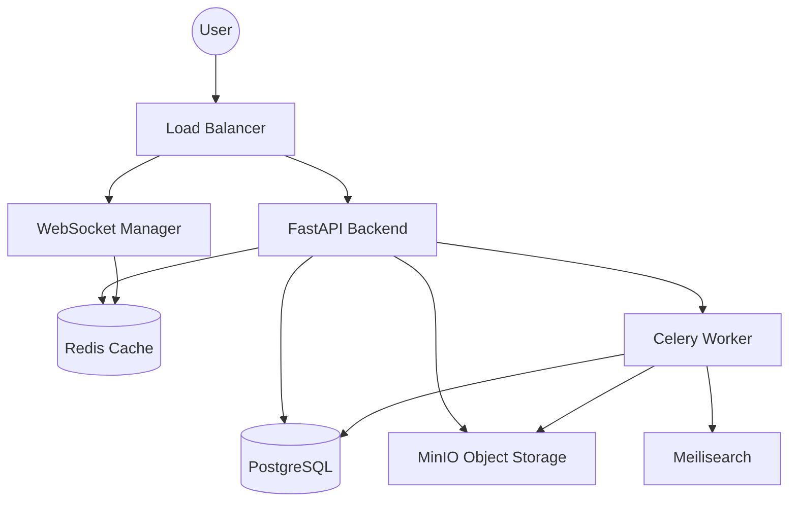

# System Architecture

## Architectural Overview
PyBase follows a multi-layered, service-oriented architecture designed for high availability, real-time collaboration, and technical data processing.

## Technology Stack
- **Backend**: FastAPI (Python 3.11+)
- **Primary Database**: PostgreSQL 15+ (using JSONB for flexible record storage)
- **Caching & Real-time**: Redis 7+
- **Task Queue**: Celery with Redis broker
- **Object Storage**: MinIO (S3 compatible)
- **Search Engine**: Meilisearch (In Progress)
- **Frontend**: React 18, TypeScript, Tailwind CSS, shadcn/ui

## Multi-layered Architecture
The backend is organized into four primary layers:

1. **API Layer (`src/pybase/api/`)**: Handles HTTP requests, authentication, and request validation using Pydantic schemas.
2. **Service Layer (`src/pybase/services/`)**: Orchestrates business logic and interacts with multiple models/resources.
3. **Model/Data Layer (`src/pybase/models/`)**: Defines SQLAlchemy ORM models and handles database interactions.
4. **Integration Layer (`src/pybase/extraction/`, `src/pybase/realtime/`)**: Handles specialized logic like CAD/PDF parsing and WebSocket management.

## Component Diagram

## Data Flow Patterns
- **Standard CRUD**: API → Service → Model → DB.
- **Real-time Updates**: Record Change → Service → Redis Pub/Sub → WebSocket Manager → Connected Clients.
- **Asynchronous Processing**: API → Celery Task → Worker → Extraction Service → DB Update → Notify Client via WebSocket.

## Security Architecture
- **Authentication**: JWT-based stateless authentication.
- **Authorization**: Role-Based Access Control (RBAC) at Workspace, Base, and Table levels.
- **Data Safety**: Input validation using Pydantic, parameterized SQL queries via SQLAlchemy, and CORS configuration.

## Scalability Considerations
- **Stateless Backend**: Multiple instances of the FastAPI app can be deployed behind a load balancer.
- **Pub/Sub**: Redis handles communication between backend instances for real-time events.
- **Task Offloading**: Heavy CAD/PDF processing is handled by Celery workers to keep the API responsive.
